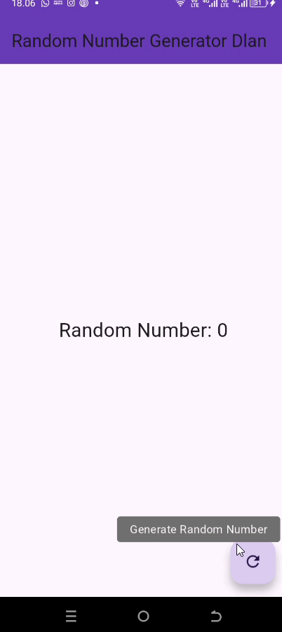

# bloc_random_dlan

A new Flutter project.

## Getting Started

This project is a starting point for a Flutter application.

A few resources to get you started if this is your first Flutter project:

- [Lab: Write your first Flutter app](https://docs.flutter.dev/get-started/codelab)
- [Cookbook: Useful Flutter samples](https://docs.flutter.dev/cookbook)

For help getting started with Flutter development, view the
[online documentation](https://docs.flutter.dev/), which offers tutorials,
samples, guidance on mobile development, and a full API reference.

## Display
### Praktikum 7
#### <u> Soal 13 </u>
Letak Konsep Pola BLoC
- random_bloc.dart, 
    - Di file ini kita membuat class `RandomNumberBloc` yang berfungsi sebagai **BLoC**-nya.
    - Mengandung `StreamController` sebagai penghubung antara **input (event)** dan **output (state)**.
    - Di sinilah logika bisnisnya berjalan, yaitu menghasilkan angka acak dan mengirimkannya lewat stream.
- random_screen.dart
    - File ini menangani bagian **UI**.
    - Menggunakan `StreamBuilder` untuk mendengarkan data dari stream di BLoC dan menampilkan hasilnya ke layar.
    - Tombol `FloatingActionButton` digunakan untuk meng-*trigger* event ke BLoC.

- Pemrosesan Data dan Sinkronisasi State
    - **Event** berupa tombol ditekan diproses oleh method di dalam BLoC.
    - **State** yang dihasilkan (angka acak) dikirim melalui stream dan ditampilkan dengan `StreamBuilder`.
    
  